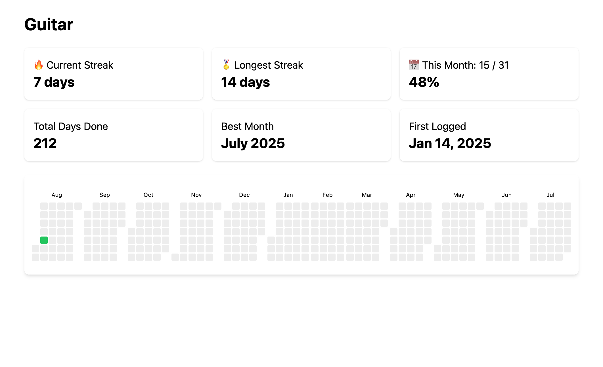

# habits

[](https://github.com/brk3/habits/actions/workflows/test.yml)
[](https://github.com/brk3/habits/actions/workflows/docker.yml)
[](https://github.com/brk3/habits/actions/workflows/frontend.yml)



## Quickstart
```bash
# Build the project
make build

# Start a habits-server
make server

# Start a frontend
cd frontend
npm install
npm run dev

# Track a habit with a note
habits track guitar "practiced riffs"

# > Open localhost:5173/habits/<habit> to view a heatmap
```

## Environment variables
```
HABITS_DB_PATH   # path to SQLite database file (default: ./habits.db)
HABITS_API_BASE  # API base URL if using remote server
```
