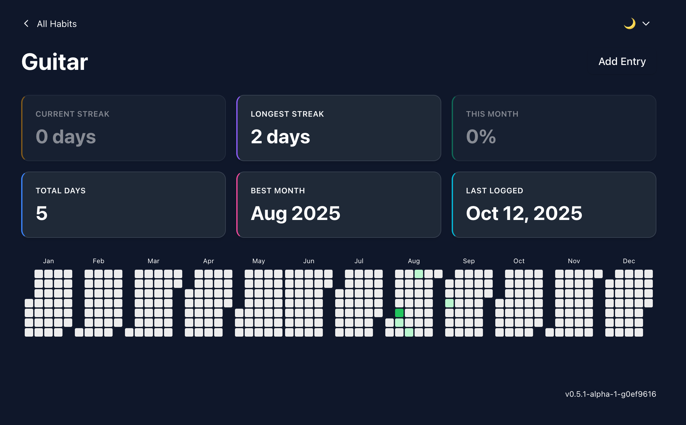

# habits

Habits is built on the idea that small, consistent actions yield the best results.

[](https://github.com/brk3/habits/actions/workflows/test.yml)
[](https://github.com/brk3/habits/actions/workflows/docker.yml)
[](https://github.com/brk3/habits/actions/workflows/frontend.yml)



## Install
```
curl -fsSL https://raw.githubusercontent.com/brk3/habits/main/install.sh | bash
```

## Quickstart
Start a server and habits API:
```
docker compose up -d
```

Track a habit!
```
habits track running '5km in park'
```

Open localhost:8080/habits/{habit} to view stats for your habit.

## Development
```bash
# Build the project
make build

# Start a habits-server
make server

# Start a frontend
make frontend

# Track a habit with a note
habits track guitar "practiced riffs"

# > Access frontend on localhost:5173/habits/{habit}
```

## Configuring
See [habitsrc](./habitsrc)